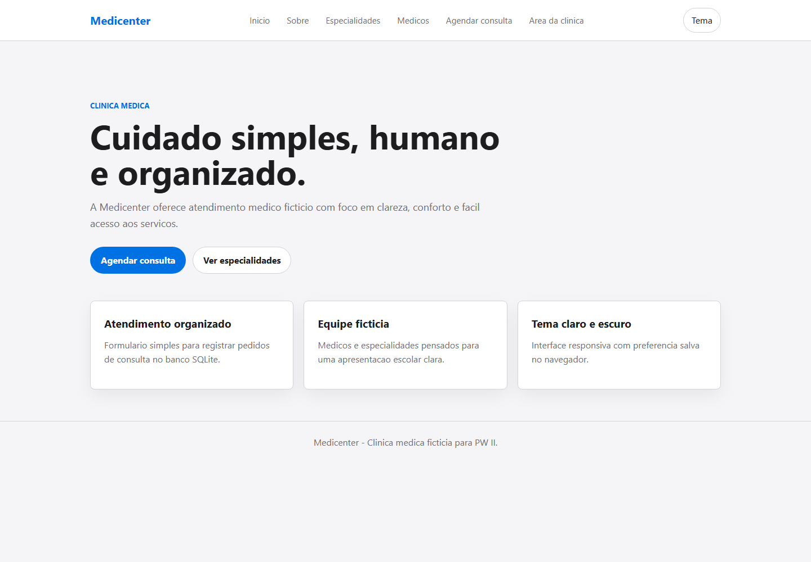
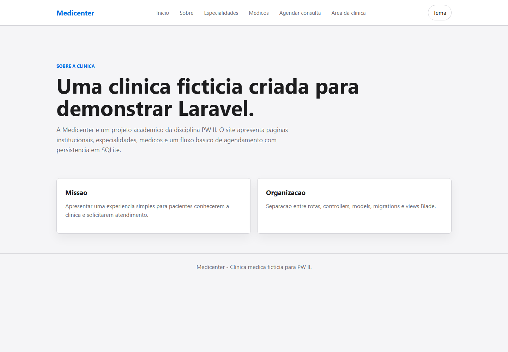
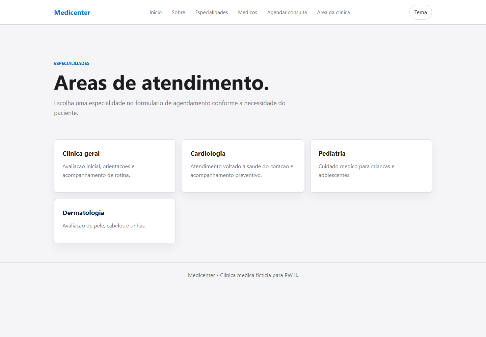
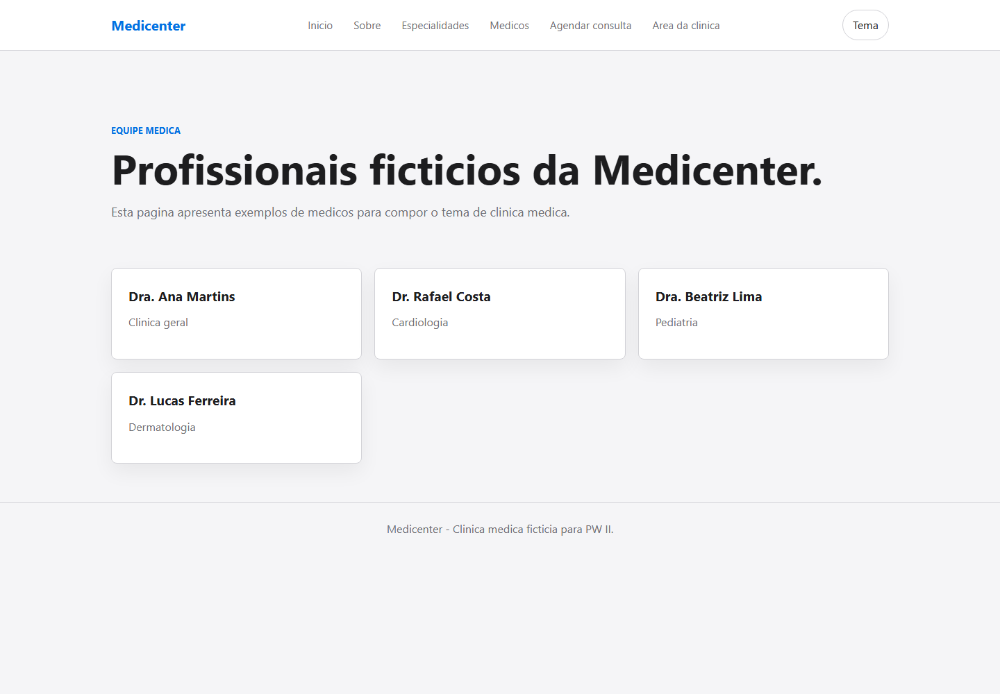
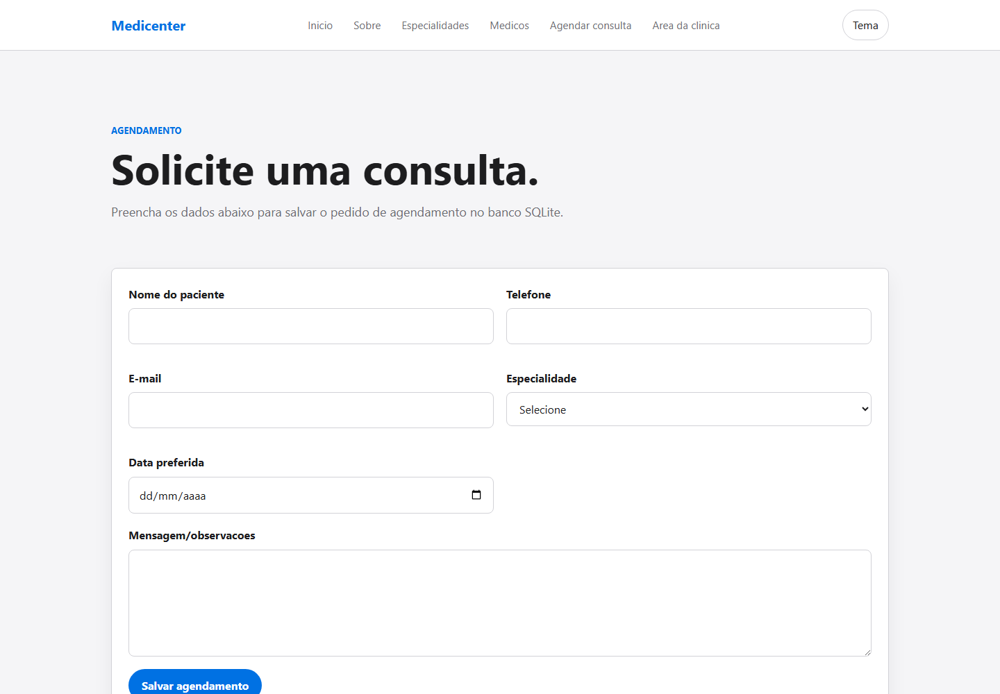
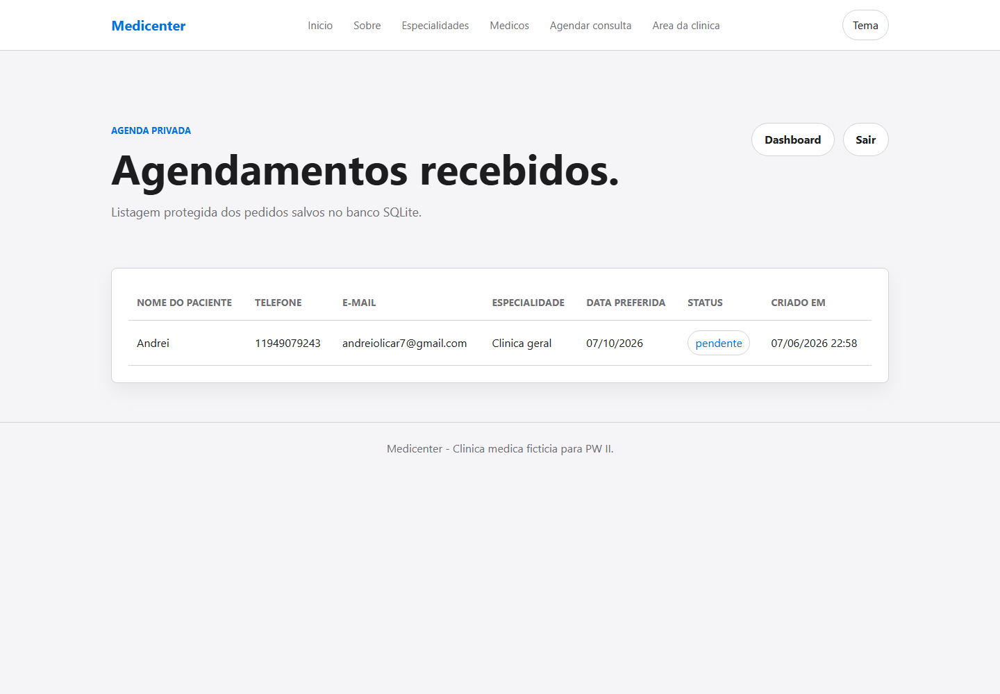
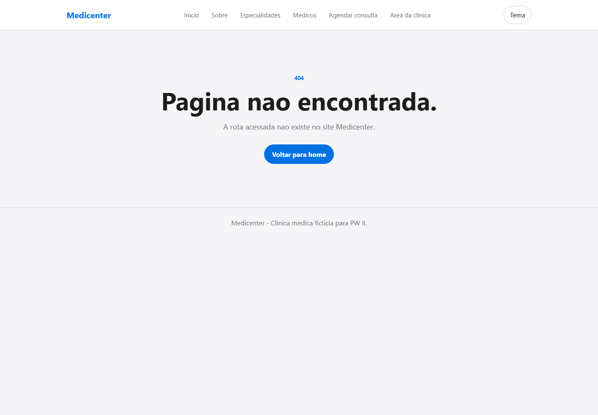
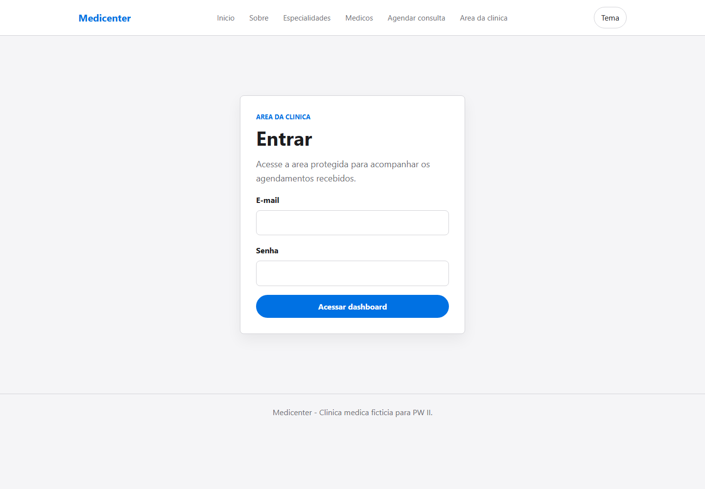
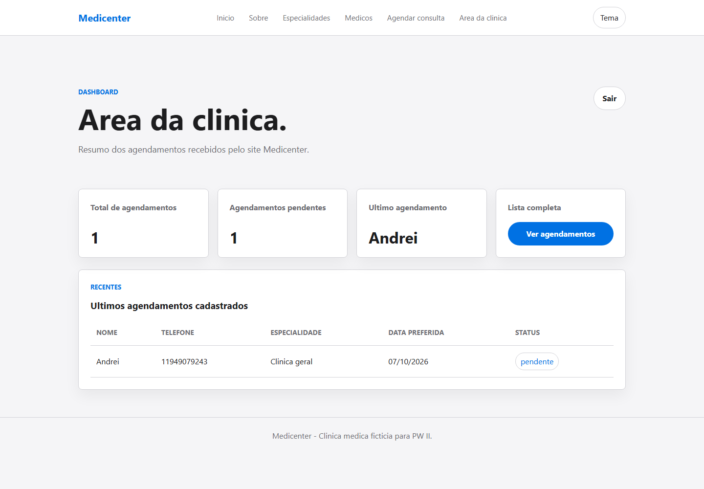

# Medicenter

Medicenter e um site ficticio de clinica medica desenvolvido em Laravel 12 para a disciplina PW II - Programacao Web II.

## Descricao

O projeto apresenta um site institucional com paginas em Blade, rotas nomeadas, tema claro/escuro, formulario de agendamento com CSRF Protection, persistencia em SQLite e uma area protegida simples para a clinica acompanhar os agendamentos.

## Requisitos da Atividade

- Tema individual: Site Clinica Medica
- Migration para a tabela `appointments`
- Formulario com `@csrf`
- Validacao antes do cadastro
- Agendamentos salvos em SQLite
- Rota fallback personalizada
- Views organizadas com layout base
- Area da clinica com login local por sessao
- Dashboard protegido
- Listagem privada dos agendamentos
- Interface limpa, responsiva e sem frameworks externos de UI

## Tecnologias

- PHP 8.2
- Laravel 12
- Blade
- SQLite
- CSS
- JavaScript simples para alternancia de tema
- Laravel Pint

## Funcionalidades

- Home da clinica
- Pagina sobre
- Pagina de especialidades
- Pagina de medicos ficticios
- Formulario publico de agendamento
- Cadastro de agendamentos no banco SQLite
- Login simples da area da clinica
- Dashboard protegido com indicadores de agendamentos
- Listagem privada dos agendamentos
- Logout da area da clinica
- Pagina personalizada para rotas inexistentes
- Tema light/dark salvo no `localStorage`

## Credenciais de Teste

As credenciais da area da clinica ficam no `.env`:

```env
CLINIC_EMAIL=clinica@medicenter.test
CLINIC_PASSWORD=medicenter123
```

Essas credenciais sao usadas somente para a atividade escolar. Elas nao sao salvas no banco e nao existe cadastro de usuarios.

## Rotas

| Metodo | Caminho | Nome | Descricao |
| --- | --- | --- | --- |
| GET | `/` | `home` | Pagina inicial |
| GET | `/sobre` | `about` | Sobre a clinica |
| GET | `/especialidades` | `specialties` | Especialidades |
| GET | `/medicos` | `doctors` | Medicos |
| GET | `/agendamento` | `appointments.create` | Formulario publico de agendamento |
| POST | `/agendamento` | `appointments.store` | Salvar agendamento |
| GET | `/clinica/login` | `clinic.login` | Login da area da clinica |
| POST | `/clinica/login` | `clinic.authenticate` | Autenticar clinica |
| POST | `/clinica/logout` | `clinic.logout` | Encerrar sessao da clinica |
| GET | `/clinica/dashboard` | `clinic.dashboard` | Dashboard protegido |
| GET | `/clinica/agendamentos` | `clinic.appointments` | Listagem privada de agendamentos |
| Fallback | qualquer rota inexistente | `not-found` | Pagina 404 personalizada |

## Estrutura do Banco

Tabela principal: `appointments`

| Campo | Tipo | Observacao |
| --- | --- | --- |
| `id` | integer | Chave primaria |
| `patient_name` | string | Nome do paciente |
| `phone` | string | Telefone |
| `email` | string | Opcional |
| `specialty` | string | Especialidade desejada |
| `preferred_date` | date | Data preferida |
| `message` | text | Opcional |
| `status` | string | Padrao: `pendente` |
| `created_at` | timestamp | Criado em |
| `updated_at` | timestamp | Atualizado em |

## Como Executar

1. Instale as dependencias PHP:

```bash
composer install
```

2. Configure o arquivo `.env` e use SQLite:

```env
DB_CONNECTION=sqlite
```

3. Configure as credenciais locais da clinica:

```env
CLINIC_EMAIL=clinica@medicenter.test
CLINIC_PASSWORD=medicenter123
```

4. Garanta que o banco exista:

```bash
type nul > database/database.sqlite
```

5. Execute as migrations:

```bash
php artisan migrate
```

6. Inicie o servidor local:

```bash
php artisan serve
```

7. Acesse no navegador:

```txt
http://127.0.0.1:8000
```

## Screenshots

As imagens da apresentacao estao salvas em `public/docs/`:

| Tela | Print |
| --- | --- |
| Inicio |  |
| Sobre |  |
| Especialidades |  |
| Medicos |  |
| Agendamento |  |
| Agendamentos |  |
| Fallback |  |
| Login da clinica |  |
| Dashboard da clinica |  |
| Agendamentos da clinica |  |

## Autor

A definir.